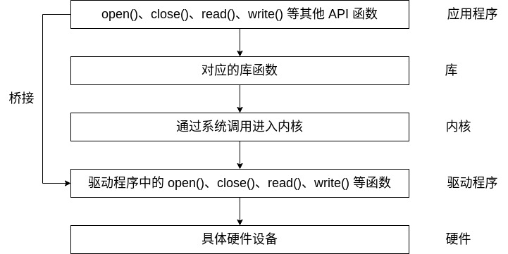

先来了解一下 Linux 下的应用程序是如何调用驱动程序的。



Linux 下一切皆文件，C 语言提供了统一的库函数接口如 open()、close()、read()、write() 对文件进行操作。驱动加载成功后，会在 Linux 系统中创建自己的文件设备，同时驱动会定义并实现自己的 open()、close()、read()、write() 等函数来操作具体的硬件。这些驱动实现函数最后由库函数封装成统一的接口供应用程序进行调用，屏蔽了底层实现的细节。

这种方式就是桥接模式。桥接模式主要是通过委托的形式来实现的。

如下，这里定义一个统一的对字符串操作的界面类:
```c++
  class StringRep;
  class String
  {
  public:
    String();
    String(const char* s);
    String(const String& s);
    String &operator=(const String& s);
    ~String();
    ...
  private:
    StringRep* pimpl;
  };
```
在上面的定义中，pimpl 是一个指针，它可以由外部传入(如果是模板类，也可以在函数构造时根据类型创建)，指向具体的字符串操作类。这里作一个简单实现:
```c++
  class StringRep
  {
    friend class String;
    StringRep(const char* s);
    ~StringRep();
    int count;
    char* rep;
    ///
  };
```
这样做的好处是实现界面接口与实现的分离。在上面的示例中，界面类 String 可以调用 StringRep 中的实现，但是也可以指向其他的实现，而界面接口却不改变，从而具有一种弹性。此外，String 与 StringRep 隔离开来，StringRep 的变动不会影响到 String 中的内容。

[示例程序](realize.cpp)
